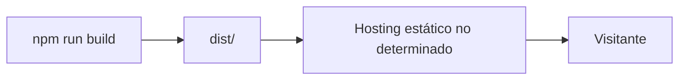

# Despliegue

```mermaid
flowchart LR
  N[npm run build] --> D[dist/]
  D --> H[Hosting estático no determinado]
  H --> V[Visitante]
```

Solo el artefacto está confirmado; proveedor, red, TLS y rollback no lo están.
