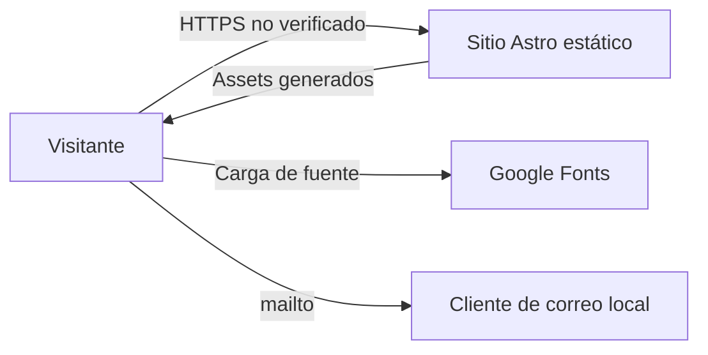

# Contexto del sistema

```mermaid
flowchart LR
  V[Visitante] -->|HTTPS no verificado| S[Sitio Astro estático]
  S -->|Assets generados| V
  V -->|Carga de fuente| GF[Google Fonts]
  V -->|mailto| MC[Cliente de correo local]
```

Estado: reconstruido desde `Layout.astro` y `Welcome.astro`; hosting y TLS no están determinados.
